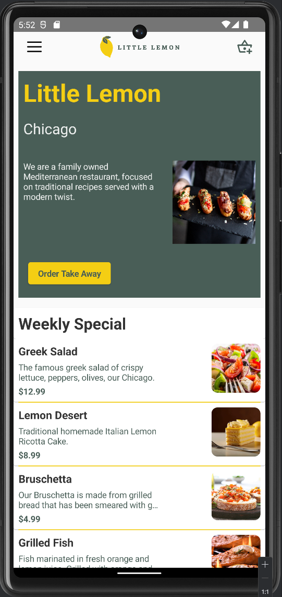
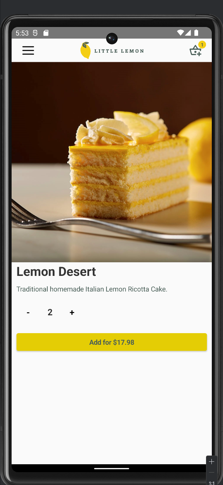
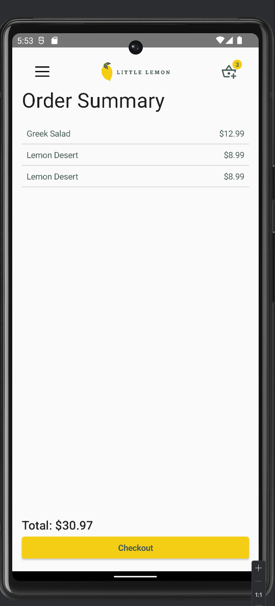

# Little Lemon 🍋

   

A modern, native Android food ordering app designed for a Mediterranean restaurant. Built entirely with **Kotlin** and **Jetpack Compose**, this project demonstrates modern Android development practices including Unidirectional Data Flow, State Management, and component-based UI design.

---

## 📱 App Screenshots

| Home Screen | Navigation Menu | Dish Details | Cart Summary |
|:---:|:---:|:---:|:---:|
|  |  |  |  |
| |  |  |

---

## 🌟 Beyond the Coursework (Custom Implementations)
While this project started as a capstone requirement, **I extended the functionality significantly** beyond the provided instructions to create a complete product experience:

* **Dynamic Cart Badge:** Implemented a real-time notification badge on the cart icon that updates instantly when items are added (using `StateFlow` and `collectAsState`).
* **Custom Navigation Drawer:** Designed and integrated a "Hamburger Menu" side bar for seamless navigation, managing the scaffold state manually.
* **Robust Navigation Graph:** Built a navigation system that correctly handles the back stack (e.g., returning to Home from any screen without loop issues).
* **Cart Logic & State:** Developed a dedicated Cart Screen that aggregates duplicate items and calculates the total price dynamically—logic that was not part of the original starter code.

---

## 🛠 Tech Stack & Libraries
* **Language:** Kotlin
* **UI:** Jetpack Compose (Material Design)
* **Architecture:** MVVM (Model-View-ViewModel)
* **Navigation:** Android Navigation Compose
* **State Management:** ViewModel, StateFlow, LiveData
* **Asynchronous:** Kotlin Coroutines

---

## 🏗 Architecture
The app follows the **MVVM (Model-View-ViewModel)** architecture pattern to ensure separation of concerns and testability:

1.  **Model:** Data classes (`Dish`, `CartItem`) defining the structure of the app's data.
2.  **ViewModel:** (`CartViewModel`) Manages the UI state and business logic (e.g., calculating totals, adding/removing items). It exposes data via `StateFlow` to be observed by the UI.
3.  **View (Compose UI):** Reactive UI components that observe the ViewModel state and recompose automatically when data changes.

---

## 🚀 How to Run
1.  Clone this repository:
    ```bash
    git clone [https://github.com/baranDincsoy/LittleLemon-JetpackCompose.git](https://github.com/baranDincsoy/LittleLemon-JetpackCompose.git)
    ```
2.  Open the project in **Android Studio**.
3.  Sync Gradle files.
4.  Run on an emulator or physical device (Min SDK 24).

---

## 🔮 Future Improvements
* **Persistence:** Integrate **Room Database** to save cart items even after the app closes.
* **Networking:** Replace local data with a real REST API using **Retrofit**.
* **Testing:** Add Unit Tests for the ViewModel logic and UI Tests for Compose.

---

Developed by **Baran Cenk Dincsoy**
